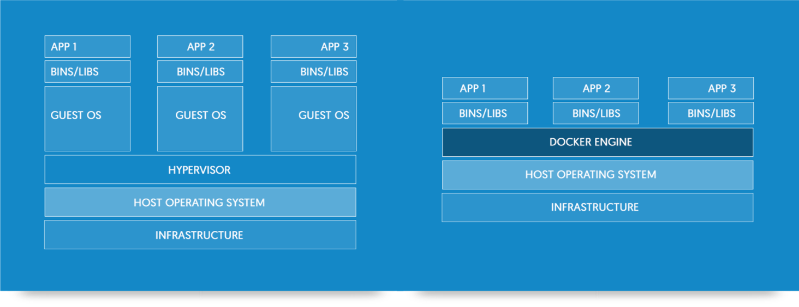
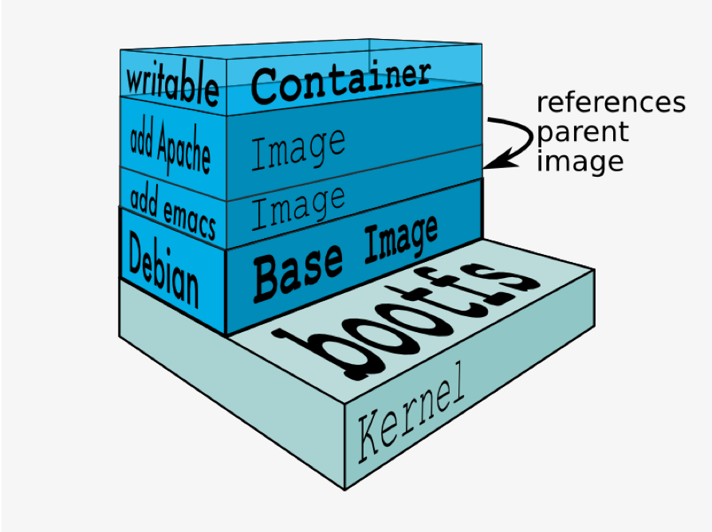
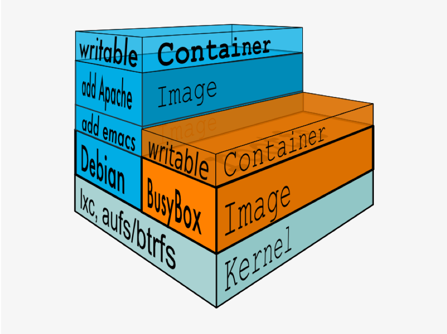

# Docker

### A basic introduction

<small>For questions contact your DevOps coach or   [Nelis](mailto:nelis.boucke@bnpparibasfortis.be) / [@nelisboucke](http://twitter.com/nelisboucke) [Matteo](mailto:matteo.pierro@bnpparibasfortis.be) / [@matteo_pierro](http://twitter.com/@matteo_pierro)</small>

---

## What?

---

## What?

> "Docker - build, ship and run any app. Anywhere"

---

## What ?

- Develop, ship and run application using virtualisation.
- Abstraction: Wrapping everything that is needed to run it on a server. Code, runtime, system tools, system libraries, config ...
- Ecosystem: whole set of tools, approaches, ...

---

## Virtual machines vs. containers

---

## Containers are like onions

---

## Containes share

---

## Brief demo

---

## Self-study connection details

host: wpnm0050.be.fortis.bank

| user  | ssh port | http port |
|-------|----------|:---------:|
| user1 | 1111     |    1180   |

| user  | ssh port | http port |
|-------|----------|:---------:|
| user2 | 2222     |    2280   |

| user  | ssh port | http port |
|-------|----------|:---------:|
| user4 | 4444     |    4480   |

